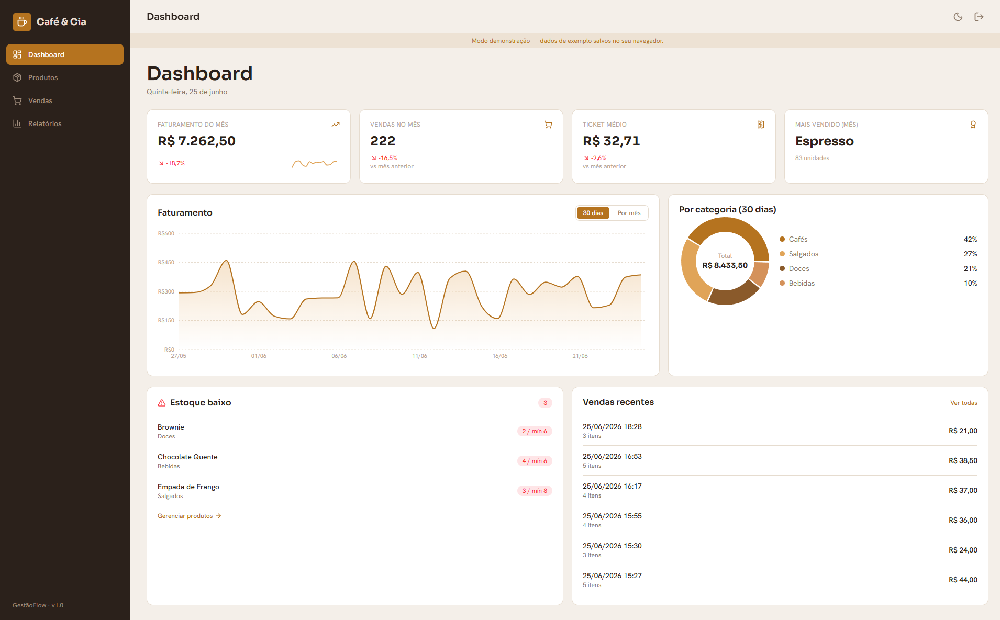
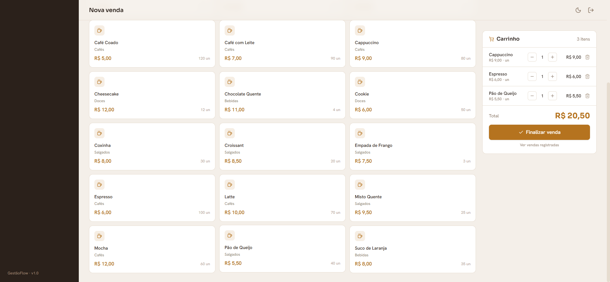
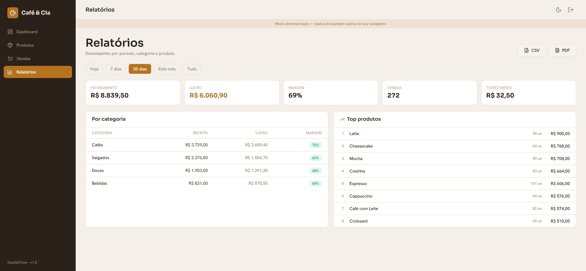
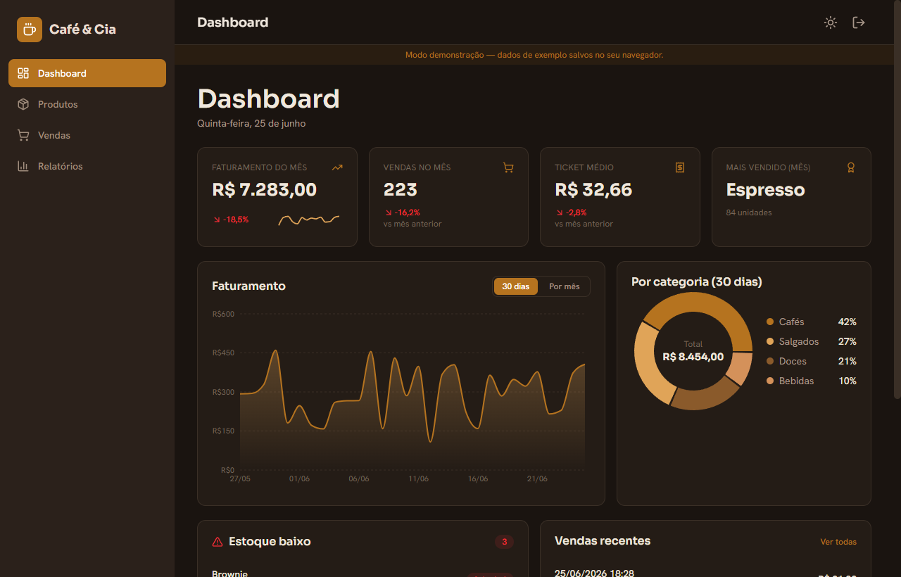
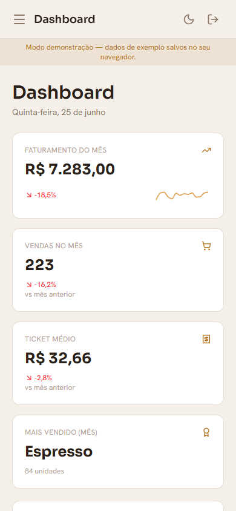

# ☕ GestãoFlow — Café & Cia

Painel de gestão (ferramenta interna) para pequeno negócio: **produtos, vendas, dashboard
com gráficos e relatórios**. Projeto de portfólio construído como um produto real — o tipo
de sistema que empresa paga caro pra ter.

> **Demo ao vivo:** _(adicione o link da Vercel após o deploy)_
>
> **Login da demo:** `dono@cafe.com` / `cafe123`



---

## ✨ Funcionalidades

- **Login** com autenticação real (Supabase Auth).
- **Dashboard**: cards de faturamento, vendas, ticket médio e produto mais vendido — com
  **comparação vs mês anterior** e **sparklines**; gráfico de faturamento (por dia / por mês),
  **donut por categoria**, **alerta de estoque baixo** e feed de vendas recentes.
- **Produtos**: CRUD completo (nome, categoria, preço, custo, estoque, estoque mínimo),
  com busca, filtro por categoria e indicador de margem.
- **PDV (nova venda)**: busca produtos, monta o carrinho, total ao vivo e finaliza —
  **baixando o estoque de forma atômica** no banco.
- **Vendas**: histórico com filtro por período e detalhe dos itens.
- **Relatórios**: faturamento por período, **por categoria (com lucro e margem)** e
  **top produtos** — com **exportação em CSV e PDF**.
- **Tema claro/escuro** com toggle (persistido).
- 100% responsivo (foco desktop/tablet).

| PDV | Relatórios | Tema escuro | Mobile |
|---|---|---|---|
|  |  |  |  |

---

## 🛠 Stack

- **Front:** React 19 + Vite + Tailwind CSS v4
- **Estado de servidor:** TanStack Query
- **Gráficos:** Recharts
- **Formulários:** React Hook Form + Zod
- **Exportação:** CSV (nativo) + PDF (jsPDF + autotable, carregado sob demanda)
- **Back:** Supabase (PostgreSQL + Auth + Row Level Security)
- **Deploy:** Vercel

## 🧠 Destaques de arquitetura

- **Venda atômica.** Registrar uma venda chama a função Postgres `create_sale(jsonb)`,
  que numa transação única valida o estoque, cria a venda + itens e **baixa o estoque** —
  impossível gravar uma venda sem dar baixa (ou vender além do estoque).
- **Analytics testado.** Todas as métricas (faturamento por dia, por categoria, top
  produtos, deltas, estoque baixo) são funções puras em `src/lib/analytics.js` com testes
  (vitest), reutilizadas pelo dashboard e pelos relatórios.
- **Modo demo sempre-no-ar.** Sem variáveis do Supabase, o app roda com dados locais
  (localStorage) e já é publicável como demo. Com as variáveis, vira backend real sem
  mudar uma linha de componente — a camada `src/lib/db/*` roteia entre os dois.

---

## 🚀 Rodando localmente

```bash
npm install
npm run dev      # http://localhost:5173 (já funciona em modo demo)
npm run test     # testes (vitest)
npm run build
```

### Conectando o Supabase (backend real)

1. Crie um projeto grátis em [supabase.com](https://supabase.com).
2. No **SQL Editor**, rode em ordem: `supabase/migrations/0001_schema.sql`,
   `0002_rls.sql`, `0003_functions.sql` e depois `supabase/seed.sql`.
3. Em **Authentication → Users**, crie o usuário do dono (e-mail + senha).
4. Copie `.env.example` para `.env` e preencha `VITE_SUPABASE_URL` e `VITE_SUPABASE_ANON_KEY`.
5. `npm run dev` — agora contra o Postgres real.

## 📦 Deploy (Vercel)

Importe o repositório na Vercel (framework **Vite** detectado automaticamente). Configure
`VITE_SUPABASE_URL` e `VITE_SUPABASE_ANON_KEY` se quiser backend real — sem elas, a Vercel
publica a demo em modo local.

---

Feito por **Leonardo Pimenta** · [github.com/leopimenta0222-dev](https://github.com/leopimenta0222-dev)
